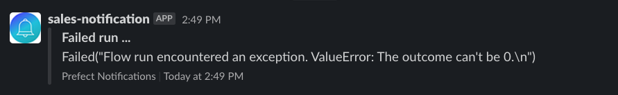

# prefect-alert

<p align="center">
    <a href="https://pypi.python.org/pypi/prefect-alert/" alt="PyPI version">
        </a>
    <a href="https://github.com/khuyentran1401/prefect-alert/" alt="Stars">
        </a>
    <a href="https://pepy.tech/badge/prefect-alert/" alt="Downloads">
        </a>
    <a href="https://github.com/khuyentran1401/prefect-alert/pulse" alt="Activity">
        </a>
    <br>
    <a href="https://prefect-community.slack.com" alt="Slack">
        </a>
    <a href="https://discourse.prefect.io/" alt="Discourse">
        </a>
</p>

## Welcome!

[Prefect](https://www.prefect.io/) is an open-source library that allows you to orchestrate and observe your dataflow defined in Python.

prefect-alert is a decorator that allows you to send alert when a Prefect task or flow fails.

Read [this article](https://medium.com/the-prefect-blog/sending-slack-notifications-in-python-with-prefect-840a895f81c?sk=ab9bba5b59c8f3468bb01cabe04b2953) if you are not familiar with how to send notifications with Prefect. 

## Getting Started

### Python setup

Requires an installation of Python 3.8+.

We recommend using a Python virtual environment manager such as pipenv, conda or virtualenv.

These tasks are designed to work with Prefect 2.0. For more information about how to use Prefect, please refer to the [Prefect documentation](https://orion-docs.prefect.io/).

### Installation

Install `prefect-alert` with `pip`:

```bash
pip install prefect-alert
```
### Create a notification block
[Blocks](https://docs.prefect.io/concepts/blocks/) enable you to store configuration and provide an interface for interacting with external systems. 

First, start with creating a [notification block](https://docs.prefect.io/api-ref/prefect/blocks/notifications/) through [UI](https://docs.prefect.io/ui/blocks/) or a Python script:

```python
from prefect.blocks.notifications import SlackWebhook

slack_block = SlackWebhook(url="https://hooks.slack.com/services/XXX/XXX/XXX")
``` 
### Send an alert
Next, use the block created and the decorator `prefect_alert.alert_on_failure` to send alert when a flow/task fails.
#### Send an alert when a flow fails

```python
from prefect import flow, task 
from prefect.blocks.notifications import SlackWebhook
from prefect_alert import alert_on_failure

@task
def may_fail():
    raise ValueError()

@alert_on_failure(block_type=SlackWebhook, block_name="test")
@flow
def failed_flow():
    res = may_fail()
    return res

if __name__=="__main__":
    failed_flow()
```
And you will see something like this on your Slack:

#### Send an alert when a task fails

```python
from prefect import flow, task 
from prefect.blocks.notifications import SlackWebhook
from prefect_alert import alert_on_failure

@alert_on_failure(block_type=SlackWebhook, block_name="test")
@task
def may_fail():
    raise ValueError()

@flow
def failed_flow():
    res = may_fail()
    return res

if __name__=="__main__":
    failed_flow()
```

#### Send an alert when a asynchronous flow fails

```python
from prefect import flow, task 
from prefect.blocks.notifications import SlackWebhook
from prefect_alert import alert_on_failure
import asyncio

@alert_on_failure(block_type=SlackWebhook, block_name="test")
@task
async def may_fail():
    raise ValueError()

@flow
async def failed_flow():
    res = await may_fail()
    return res

if __name__=="__main__":
    asyncio.run(failed_flow())
```
## Resources

If you encounter any bugs while using `prefect-alert`, feel free to open an issue in the [prefect-alert](https://github.com/khuyentran1401/prefect-alert) repository.

If you have any questions or issues while using `prefect-alert`, you can find help in either the [Prefect Discourse forum](https://discourse.prefect.io/) or the [Prefect Slack community](https://prefect.io/slack).

Feel free to ⭐️ or watch [`prefect-alert`](https://github.com/khuyentran1401/prefect-alert) for updates too!

## Development

If you'd like to install a version of `prefect-alert` for development, clone the repository and perform an editable install with `pip`:

```bash
git clone https://github.com/khuyentran1401/prefect-alert.git

cd prefect-alert/

pip install -e ".[dev]"

# Install linting pre-commit hooks
pre-commit install
```
